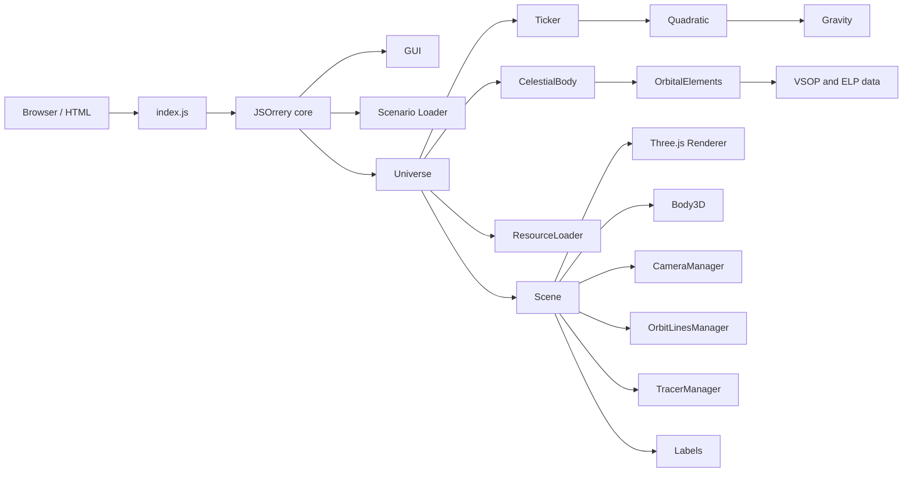
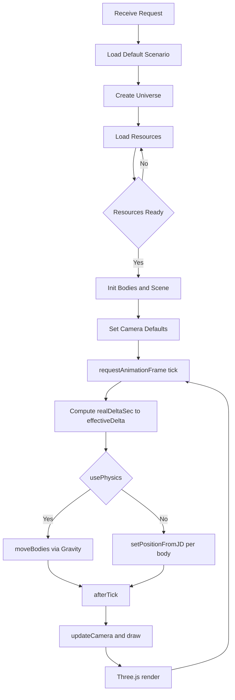

# jsOrrery Architecture and Internals

This document explains how jsOrrery works, how the universe is set up, and how data flows through the system. It also includes Mermaid diagrams for the overall system design and the per-frame runtime flow.

## Overview

- jsOrrery is a WebGL Solar System and orbital mechanics simulator built with Three.js and custom orbital/physics code.
- Bodies are defined in scenario files via orbital elements or high‑precision ephemerides; the engine renders 3D geometry, camera views, orbit lines, and labels, and can animate via orbital elements or n‑body gravity integration.

## System Design




## Runtime Flow



## How the Universe Is Set Up

- Scenario merge: `src/scenario/Loader.js` merges `commonBodies` and per‑scenario overrides into `scenario.bodies` and sets defaults/help.
- Bodies assembly: `core/Universe.js` creates `CelestialBody` objects from scenario configs, indexes them by name, and finds the central body.
- Central body: The largest mass (or body marked as central) becomes the system’s central body and gets specialized handling in the scene (Sun vs. external sun light source).
- Initial positions: `CelestialBody.init()` binds orbital elements, relatives (e.g., satellites), and then `setPositionFromJD(jd)` computes the starting position.
- Barycenter (physics only): Universe offsets the central body’s position and velocity to balance momentum when `usePhysics` is enabled.
- Scene setup: After initialization, Scene adds a `Body3D` for each body, sets camera defaults, computes dimension scaling, and prepares orbit/tracer managers and labels.

## Physics vs. Elements

- Elements mode (default): Positions come from `algorithm/OrbitalElements` using Keplerian elements and time evolution; velocity is derived from elements (vis-viva / tangential direction) or finite differences when needed.
- Physics mode (`scenario.usePhysics: true`): Ticker integrates motion using `Quadratic` and `Gravity`, stepping multiple sub‑calculations per tick for stability. Universe will also place the central body according to barycenter.
- Mixed precision: Some bodies supply a `positionCalculator(jd)` (e.g., VSOP for Earth, ELP for Moon) for high‑precision positions when needed.

## Timekeeping and Scaling

- Simulated time: Universe uses wall‑clock delta per frame and multiplies by `simSecondsPerRealSecond` (default 1000) to compute the effective simulated seconds advanced each frame.
- GUI speed: The “Animation speed” slider controls the base `Ticker.secondsPerTick`. Universe passes the per‑frame effective delta to `Ticker.tick(...)` so that physics and per‑body updates use the correct elapsed simulation time.
- Scaling: `graphics3d/Dimensions` sets a scale from the largest semi‑major axis to keep Three.js coordinates within a stable numeric range. Distances (m) and vectors are converted to scene units when rendered.

## Rendering Pipeline

- Scene: Three.js `Scene`, `WebGLRenderer`, ambient light; optional external sun for non‑sun‑centric scenarios; labels, orbits, tracers.
- Body3D: Creates sphere geometry and optional rings, applies textures, handles tilt and sidereal rotation, and updates per frame.
- Orbits and traces: `OrbitLinesManager` builds orbit lines from either element‑derived ellipses or precise sampled positions; `TracerManager` draws motion trails.
- Camera: `CameraManager` manages free/orbital/POV cameras, look‑at targets (body, front/back velocity, night vector, mouse direction), and optional geographic POV on Earth.

## Extending the Project

### Add a new scenario
1. Create `src/scenario/scenarios/MyScenario.js`:
   ```js
   import { sun } from './bodies/sun';
   import { earth } from './bodies/earth';
   export default {
     name: 'MyScenario',
     title: 'My Custom Scenario',
     commonBodies: [sun, earth],
     bodies: { /* optional per‑scenario overrides */ },
     secondsPerTick: { min: 60, max: 3600*24, initial: 3600 },
     usePhysics: false,
     help: 'Short description for the GUI help panel.'
   };
   ```
2. Register it in `src/scenario/Loader.js` by adding it to the `all` array.

### Add a new body
Create `src/scenario/scenarios/bodies/mybody.js` with fields like:
```js
export const mybody = {
  title: 'My Body',
  name: 'mybody',
  mass: 1.23e22,          // kg
  radius: 1200,           // km
  color: '#aaaaaa',       // or map: 'path/to/texture.jpg'
  relativeTo: 'sun',      // or parent body name
  tilt: 5.0,              // degrees
  siderealDay: 12345,     // seconds (optional)
  orbit: {
    base: { a: 1.1*AU, e: 0.02, i: 1.2, l: 10, lp: 20, o: 30 },
    cy: { /* per‑century drift (optional) */ },
    day: { /* per‑day drift (optional) */ }
  }
  // Optional high‑precision ephemeris
  // positionCalculator: (jd) => new THREE.Vector3(x_m, y_m, z_m)
};
```

## Key Files

- Entrypoints
  - `src/index.html` – Example HTML page that initializes jsOrrery.
  - `src/index.js` – Exposes `JSOrrery` globally and shims UI assets.
- App Core
  - `src/core/JSOrrery.js` – Top‑level app: GUI, scenario loading, Universe lifecycle.
  - `src/core/Universe.js` – Simulation loop, time, body assembly, barycenter, scene.
  - `src/core/CelestialBody.js` – Per‑body state, motion, velocities, revolution callbacks.
- Simulation
  - `src/algorithm/OrbitalElements.js` – Position/velocity from Keplerian elements.
  - `src/algorithm/Ticker.js` – Per‑tick orchestration and integration control.
  - `src/algorithm/Quadratic.js` & `src/algorithm/Gravity.js` – Integrator and forces.
- Rendering
  - `src/graphics3d/Scene.js`, `src/graphics3d/Body3d.js`, `src/graphics3d/CameraManager.js`.
  - `src/graphics3d/lines/*` – Orbit and trace rendering.
  - `src/graphics3d/Dimensions.js` – World scaling.
- Scenarios
  - `src/scenario/Loader.js` – Scenario registry/merge.
  - `src/scenario/scenarios/*.js` – Built‑in scenarios and bodies.

## Notes on Accuracy

- Elements mode provides excellent planet positions over normal date ranges.
- Physics mode is illustrative and can drift for large time steps; improve stability by lowering `secondsPerTick` and/or increasing `calculationsPerTick` in scenarios.
- Distances are scaled in rendering to avoid floating‑point issues; visual planet scale is separately adjustable from the GUI.

## Scenarios Appendix

Below is a quick reference for each built‑in scenario: what it shows, notable settings, and any special behavior.

- Solar System (`src/scenario/scenarios/SolarSystem.js`)
  - Bodies: Sun + Mercury–Neptune + Pluto.
  - Purpose: Full view of the solar system; default showcase.
  - Physics: Off (element‑driven).
  - Time: `secondsPerTick` ≈ 5–25 hours, default 10 h.

- Solar System with Dwarves (`src/scenario/scenarios/SolarSystemDwarves.js`)
  - Bodies: Solar System planets plus Pluto, Ceres, Eris, Makemake, Haumea, and Halley’s Comet.
  - Purpose: Adds dwarf planets and an approximate Halley orbit.
  - Physics: Off.
  - Time: Same as Solar System.
  - Note: Halley’s orbit is approximate per in‑file note.

- Inner Solar System (`src/scenario/scenarios/InnerSolarSystem.js`)
  - Bodies: Sun, Mercury, Venus, Earth, Moon, Mars.
  - Purpose: Focused view of inner planets including the Moon.
  - Physics: Off.
  - Time: 1 minute–15 hours, default 1 h.

- Earth–Moon (`src/scenario/scenarios/EarthMoon.js`)
  - Bodies: Earth and Moon (high‑precision ephemerides: VSOP and ELP).
  - Purpose: Earth–Moon dynamics and lunar phases.
  - Physics: Off (element/ephemeris driven).
  - GUI: Forced `scale: 1` for natural relative sizing.
  - Time: 1 minute–5 hours, default 1 h.

- Artificial Satellites (`src/scenario/scenarios/ArtificialSatellites.js`)
  - Bodies: Earth + selected human spacecraft (e.g., Mercury 6/7/8, Hubble) with simplified orbits.
  - Purpose: Illustrate differing LEO orbits and inclinations.
  - Physics: Off.
  - Time: 1–10 seconds, default 5 s (fast to see multiple revolutions).
  - Note: Orientation/epoch data is incomplete; shapes are illustrative.

- Jupiter and Galilean Moons (`src/scenario/scenarios/JupiterMoon.js`)
  - Bodies: Jupiter + Io, Europa, Ganymede, Callisto.
  - Purpose: Show Laplace resonance behavior visually.
  - Physics: Off (element‑driven with periods via `day.M`).
  - GUI: Forced `scale: 1` for compact system.
  - Time: 100–3600 seconds, default 500 s.

- Big Jupiter (`src/scenario/scenarios/BigJupiter.js`)
  - Bodies: Solar System planets; Jupiter’s mass ×1000.
  - Purpose: “What if” perturbation demo with gravitational tracing.
  - Physics: On (`usePhysics: true`), `useBarycenter: false`.
  - Tracing: Many bodies set `forceTrace` and `traceRelativeTo: 'universe'`.
  - Time: 1–15 hours, default 5 h.

- Apollo Free‑Return (`src/scenario/scenarios/Apollo.js`)
  - Bodies: Earth, Moon, and an Apollo TLI vehicle built from mission data.
  - Purpose: Visualize the Apollo free‑return trajectory.
  - Physics: On, high `calculationsPerTick: 200`.
  - Time: 100–500 seconds, default 200 s.
  - GUI: Forces date to the TLI epoch; `scale: 1`.
  - Notes: Moon can be forced to high‑precision mode; event labels show closest approach and stop conditions.

- Near Earth Objects (NEO) (`src/scenario/scenarios/NearEarthObject.js`)
  - Bodies: Sun, Mercury, Venus, Earth, Moon, Mars + top N close‑approach NEOs loaded at runtime.
  - Purpose: Show next close passages (< 0.1 AU) from a NEO feed.
  - Physics: Off.
  - Time: 1 minute–5 hours, default 1 h.
  - Notes: Scenario uses dynamic loading; network access required for live feed.

- Moon Sphere of Influence (SOI) (`src/scenario/scenarios/MoonSOI.js`)
  - Bodies: Earth, Moon, and three test bodies: `inside`, `outside`, `limit` (relative to Moon).
  - Purpose: Demonstrate Moon’s gravitational SOI compared to Earth’s.
  - Physics: On, very high `calculationsPerTick: 1000` for stability.
  - GUI: `scale: 1`.
  - Time: 1–15 hours, default 5 h.
