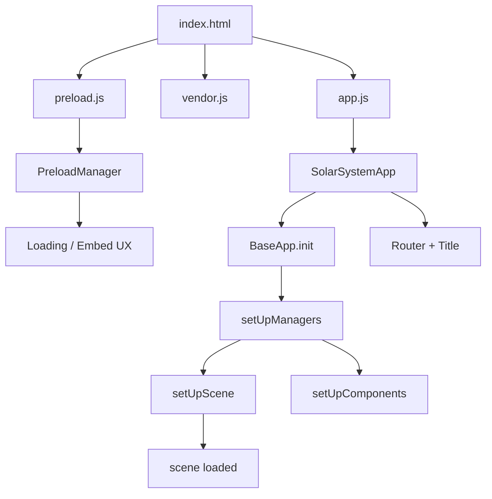
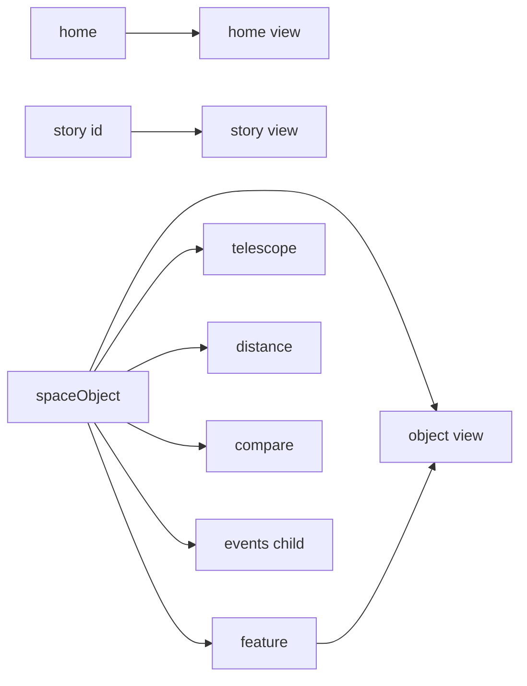

# Eyes App Architecture

This folder contains a prebuilt (Webpack‑bundled) version of NASA/JPL “Eyes on the Solar System.” The code is organized around a core `SolarSystemApp` class extending a UI/3D framework (referred to in code as "Pioneer" + Eyes framework) and a set of managers/components registered at runtime.

## High‑Level Overview

- Entry HTML (`eyes/index.html`) provides DOM anchors for 3D and UI:
  - `#pioneer` for 3D viewport
  - `#ui` for UI layout
  - `#loading-screen` and `#embed-overlay` for preload/embed UX
- Bundles (prebuilt):
  - `common.js` – Webpack runtime/bootstrap for code splitting
  - `vendor.js` – Framework and third‑party libs (BaseApp, SceneManager, etc.)
  - `preload.js` – PreloadManager: loading/embedding overlay logic
  - `app.js` – App logic: routes, managers, layers, components
- The app uses a registry/IOC pattern (`Types`) to look up framework classes and managers at runtime.

## Startup Sequence

Notes
- The preload manager builds the loading or embed overlay while the app/framework initialize.
- `SolarSystemApp` delegates most heavy lifting to framework managers (`SceneManager`, `TimeManager`, `RouterManager`, etc.).

## Core Class and Managers

- `SolarSystemApp` (eyes/app.js:22)
  - Extends `BaseApp` (from `vendor.js`).
  - Injects config/registries: `_timeInfo`, `_sceneInfo`, `_viewClasses`, `_viewInfo`, `_componentInfo`.
  - Key hooks:
    - `init()` – calls base init, hides loading, updates embed progress, tweaks entity DB (Bennu radius), refreshes menu.
    - `setUpRoutes()` – registers app routes.
    - `setUpManagers()` – wires content/search/title/autoplay/camera follow, etc.
    - `setUpComponents()` – toggles default layers and hooks breadcrumb navigation.

- Managers used (partial list from app.js):
  - `RouterManager` – route patterns and navigation
  - `ContentManager` – entity DB, stories and lists
  - `SearchManager` – text search over entities
  - `TitleManager` – dynamic document titles based on route + content
  - `AutoplayManager` – scripted tours from `autoplay.json`
  - `CameraFollowManager` – camera tracking of selected object
  - `SceneManager` – 3D scene + viewport lifecycle (awaited via `getLoadedPromise()`)

## Routing Model

The `TitleManager` parse function builds human‑friendly page titles from content metadata (IAU/display/alt names), story slides, compare target IDs, and event titles.

## Layers and Scene

- Visual layers (toggled in `setUpComponents()`):
  - Default visible: `ui`, `planets`, `spacecraft`, `trails`, `labels`, `icons`
  - Default hidden: `asteroids`, `comets`, `dwarfPlanets`, `constellations`
- The Scene is provided by the framework; app waits for `scene.getLoadedPromise()` before proceeding.

## Preload and Embed UX

- `PreloadManager` (eyes/preload.js:13):
  - Detects `?embed=true` / `?interactPrompt=true` to show an embed overlay instead of the loading screen.
  - Builds DOM for loading stars/logo/progress bar, or an embed “View 3D” gate with interaction prompt.
  - Derives a readable title from the hash route for the embed overlay (e.g., Story slide, Telescope mode, Events, Compare).
  - Public helpers: `hideLoadingScreen()`, `updateEmbedLoadPercent(%)`, `showEmbedViewButton()`, `showEmbedInteraction()`.

## Data: Entities and Stories

- Entities DB exposed via `ContentManager` and `p.Entity._entities` (e.g., Bennu radius tweak in `init()`).
- Stories: `STORY_LIST` and `STORIES` arrays/objects drive narrative content and are registered into `ContentManager` during `setUpManagers()`.

## Webpack Runtime

- `common.js` is the Webpack bootstrap. The global chunk namespace is `self.webpackChunksolar_system`.
- App and preload bundles push their modules into this namespace; `vendor.js` supplies most framework classes.

## Known Integration Notes

- The HTML references `vendors.css` and `commons.js`, while files present are `vendor.css` and `common.js`. Adjust names if serving directly.
- Code is already minified/bundled; framework internals (BaseApp, managers, views) live in `vendor.js` and aren’t editable here.
