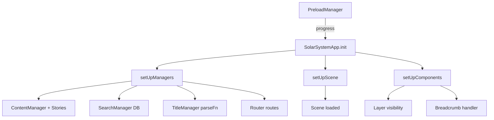

# Eyes App Code Walkthrough

This walkthrough highlights the important files, classes, and flows in the prebuilt Eyes app.

## Files and Roles

- index.html (eyes/index.html:1)
  - Declares app containers: `#pioneer`, `#ui`, `#loading-screen`, `#embed-overlay`.
  - Loads CSS: `preload.css`, `vendors.css`, `app.css`.
  - Loads JS (order matters): `config.js`, `commons.js`, `preload.js`, `vendors.js`, `app.js`.

- Webpack runtime (eyes/common.js:1)
  - Standard Webpack bootstrap: module registry, chunk queue, and loader under `self.webpackChunksolar_system`.

- Preload bundle (eyes/preload.js:13)
  - `class PreloadManager` handles two modes:
    - Loading screen: builds starfield/logo/progress bar and shows progress updates.
    - Embed overlay: shows a “View 3D” gate with interaction prompt and inferred title.
  - Key methods:
    - `_isEmbed()`, `_isInteractPrompt()` – detect URL flags
    - `_showLoadingScreen()`, `_showEmbedScreen()` – build DOM overlays
    - `showEmbedViewButton()`, `showEmbedInteraction()` – interaction gating
    - `hideLoadingScreen()`, `updateEmbedLoadPercent(%)` – status updates
  - Title inference uses hash route parsing and story/entity metadata for human‑readable strings.

- App bundle (eyes/app.js:22)
  - `class SolarSystemApp extends BaseApp` is the main orchestrator.
  - Constructor injects config registries:
    - `_timeInfo`, `_sceneInfo` – time/scene defaults
    - `_viewClasses` – view class mapping
    - `_viewInfo`, `_componentInfo` – metadata for views/components
  - Lifecycle:
    - `async init()` – runs `BaseApp.init()`, tweaks Bennu’s radius in the entity DB, hides loading, sets embed progress, refreshes menu.
    - `setUpRoutes()` – registers routes with `RouterManager`:
      - `/` → `home`
      - `/story/:id` → `story`
      - `/:spaceObject` → `object`
      - `/:spaceObject/compare|telescope|distance`
      - `/:spaceObject/:feature` and `/:spaceObject/events/:child`
    - `async setUpScene()` – awaits `scene.getLoadedPromise()` to ensure 3D is ready.
    - `async setUpManagers()` – adds/manages:
      - `link` (`LinkManager`), `cameraFollow` (`CameraFollowManager`)
      - Seeds `ContentManager` with `STORY_LIST` and `STORIES` and passes its entity list to `SearchManager`.
      - Configures `TitleManager` with a `parseFn` that computes page titles from route params and content metadata (IAU/display/alt names, story slide, compare/events/telescope views).
      - Initializes `AutoplayManager` from `autoplay.json`.
    - `async setUpComponents()` – default layer visibility and breadcrumb wiring:
      - Ensures visible: `ui`, `planets`, `spacecraft`, `trails`, `labels`, `icons`.
      - Ensures hidden: `asteroids`, `comets`, `dwarfPlanets`, `constellations`.
      - Breadcrumb click navigates while preserving time (`keepTime: true`).
      - Resets main viewport div offsets.
  - Versions helpers: `getVersion()`, `getVersions()` (app/pioneer/eyes).

## Control/Data Flow

## Where Things Live (bundled)

- Framework classes (`BaseApp`, `SceneManager`, `TimeManager`, `RouterManager`, etc.) are in `vendor.js`.
- App registries (`Types`, `view/component` maps, entity/story data) are imported via numeric webpack module IDs in `app.js` and `preload.js`.
- Because code is bundled/minified, direct class definitions aren’t editable here; behavior is wired through manager registration and config calls in `app.js`.

## Notes and Gotchas

- File name mismatches in HTML (plural vs. singular) may need correction when hosting:
  - Present files: `common.js`, `vendor.js`, `vendor.css`
  - HTML references: `commons.js`, `vendors.js`, `vendors.css`
- `p.Entity._entities` indicates an entity DB exposed by the framework; app code safely mutates some fields (e.g., Bennu radius) after base init.

