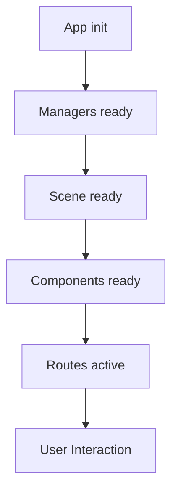

# Eyes App Design Notes

This document captures the key design decisions and extensibility points observed in the prebuilt Eyes app.

## Design Goals

- Separate content/routes/UI wiring (app code) from rendering and platform (framework/managers in vendor bundle).
- Provide rich routing (object, feature, telescope, events, compare, story) with human‑readable titles and shareable links.
- Offer an accessible preload/embed experience for slow loads and external embeds.

## Key Patterns

- Inversion of Control via `Types` registry:
  - `BaseApp` looks up managers/components/views by string keys.
  - App registers or adds managers by key, allowing substitution or addition without patching the framework.

- Route‑Driven UI:
  - `setUpRoutes()` defines all app routes in one place.
  - `TitleManager` `parseFn` centralizes title logic from route params and content metadata.

- Layered Rendering:
  - Named layers (`planets`, `spacecraft`, `labels`, etc.) provide coarse feature toggles.
  - `LayerPanel` component toggles layers; app sets initial visibility per product needs.

- Content as Data:
  - `STORY_LIST`/`STORIES` define narrative slides; `ContentManager` owns them.
  - Entities DB powers search, titles, selection, and rendering.

- Progressive Load & Embeds:
  - `PreloadManager` builds dynamic DOM for loading stars/logo and an embed “View 3D” gate.
  - Small public API exposes progress and transition steps to app bundle.

## Extensibility Points

- Managers: Add or replace via `addManager(key, ClassOrFactory, ...args)`. Examples:
  - Add analytics, custom link shortener, or telemetry manager.
  - Add a `WMTSManager` or new data source for map layers.

- Components/Views: Extend the `_componentInfo` / `_viewClasses` registries to add new UI components or routes.

- Content: Register new stories/entities in `ContentManager` and hook into search/title parseFn.

## Integration with jsOrrery (proposed)

If you plan to port features into the existing jsOrrery app, consider this staged approach:

1) Routing & Titles
- Add a lightweight `RouterManager` wrapper to jsOrrery to support the Eyes route patterns.
- Implement a title generator similar to `TitleManager.parseFn` using jsOrrery’s scenario/body metadata.

2) Layers & UI
- Introduce a layer abstraction in jsOrrery for `planets`, `spacecraft`, `trails`, `labels`, etc.
- Provide a simple layer panel component; map toggles to existing jsOrrery managers (Scene, Orbit lines, Tracers, Labels).

3) Content
- Define an entity registry from jsOrrery’s scenario bodies and optional spacecraft datasets.
- Add a search index and a content module to support object routes, compare/telescope/event views incrementally.

4) Preload/Embed
- Add a `PreloadManager` equivalent to show a starfield + progress bar and an optional embed interaction gate.

5) Camera Follow
- Port/add a `CameraFollowManager` to track selected bodies with smooth motion and view presets.

6) Stories / Tours (Optional)
- Add a simple JSON format for tours; implement an autoplay manager to script camera, time, and UI steps.

## Simple Runtime Flow

## Risks and Constraints

- This folder is bundled; changes to framework behavior require upstream source or adapter code.
- Filename mismatches in HTML (vendors/commons) should be corrected before static hosting.

